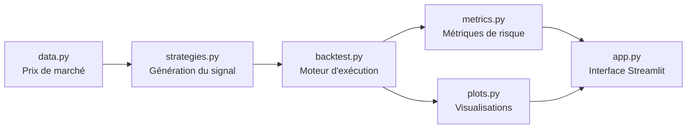

<div align="center">

# 📈 Backtester Quantitatif

**Plateforme web de backtesting et d'analyse de stratégies de trading systématique**

Teste des stratégies *momentum* et *mean-reversion* sur données de marché réelles, avec un arsenal complet d'analyse du risque, de validation de robustesse et de détection d'overfitting.

[](https://www.python.org/)
[](https://streamlit.io/)
[](https://plotly.com/)

### 🔗 [**Essayer l'application en direct**](https://backtester-quantitatif-t28rwfjkhqt8x4v9pzm7m2.streamlit.app/)

</div>

---

## Sommaire

- [Aperçu](#-aperçu)
- [Fonctionnalités](#-fonctionnalités)
- [Architecture](#️-architecture)
- [Installation](#-installation)
- [Utilisation](#-utilisation)
- [Concepts quant illustrés](#-concepts-quant-illustrés)
- [Stack technique](#️-stack-technique)
- [Pistes d'évolution](#️-pistes-dévolution)

---

## Aperçu

Ce projet simule l'application de règles de trading précises sur l'historique boursier, puis mesure **objectivement** leur performance et leur risque. Il illustre une démarche quantitative complète : de la génération de signaux jusqu'à la validation statistique d'une stratégie — en insistant sur les pièges qui rendent la plupart des backtests trompeurs (*look-ahead bias*, *overfitting*).

---

## Fonctionnalités

### Deux stratégies aux philosophies opposées
- **Momentum — Croisement de moyennes mobiles (SMA)** : suit la tendance (golden cross / death cross)
- **Mean-Reversion — RSI** : parie sur le retour à la moyenne (achat en survente, vente en surachat)

### Moteur de backtest réaliste
- **Frais de transaction** appliqués à chaque trade
- **Stop-Loss / Take-Profit** paramétrables
- **Exécution à t+1** pour éviter le *look-ahead bias* — le signal du jour `t` n'est tradable que le lendemain

### Analyse de performance et de risque
- Rendement total, **CAGR**, ratios de **Sharpe**, **Sortino** et **Calmar**
- **Max drawdown**, **Value at Risk** (historique + paramétrique)
- Comparaison systématique vs **Buy & Hold**
- **Analyse trade par trade** : win rate, profit factor, durée moyenne, P&L individuel

### Validation de robustesse
- **Walk-Forward Analysis** : découpe la période en fenêtres indépendantes pour tester la cohérence dans le temps
- **Optimisation par grid search** avec heatmap : visualise la sensibilité aux paramètres pour distinguer une vraie stratégie d'un cas d'overfitting
- **Simulation Monte Carlo** : projette des milliers de trajectoires de prix pour cadrer l'incertitude future

---

## Architecture

Le projet sépare nettement **la logique métier** (testable sans interface) de **l'affichage**.



```
├── app.py          # Interface Streamlit + orchestration
├── strategies.py   # Génération des signaux (le "cerveau" — pattern stratégie)
├── backtest.py     # Moteur d'exécution, walk-forward, grid search, Monte Carlo
├── metrics.py      # Métriques globales et par trade
├── plots.py        # Graphiques Plotly
├── data.py         # Chargement des données de marché (yfinance)
└── requirements.txt
```

**Point de design clé — le pattern stratégie** : le moteur d'exécution (`backtest.py`) ne connaît qu'une colonne `signal` (1 = investi, 0 = cash). Il ignore totalement *comment* ce signal a été produit. Ajouter une nouvelle stratégie ne demande donc qu'un `elif` dans `strategies.py` — sans jamais toucher au moteur, au walk-forward ou aux métriques.

Le moteur étant découplé de Streamlit, il est directement utilisable en notebook ou en test :

```python
from data import load_data
from backtest import run_backtest
from metrics import compute_metrics

df, _ = load_data("SPY", "2018-01-01", "2024-01-01")
df, buys, sells, final, trades = run_backtest(
    df, strategy="rsi", params={"period": 14, "oversold": 30, "overbought": 70},
    capital=10_000, fees=0.001, stop_loss=-0.10
)
print(compute_metrics(df, 10_000)["sharpe"])
```

---

## Installation

```bash
git clone https://github.com/AROY648/backtester-quantitatif
cd backtester-quantitatif
pip install -r requirements.txt
streamlit run app.py
```

L'application s'ouvre sur `http://localhost:8501`.

---

## Utilisation

1. Choisis une **stratégie** et un **ticker** (ex : `SPY`, `AAPL`, `TSLA`) dans la barre latérale
2. Règle les paramètres, les frais, et optionnellement un stop-loss / take-profit
3. Clique sur **Lancer le backtest**
4. Analyse : performance vs Buy & Hold, trades individuels, robustesse walk-forward, heatmap d'optimisation, projections Monte Carlo

> **Expérience recommandée** : lance la *même* action avec les deux stratégies. Elles performent dans des **régimes de marché opposés** — le momentum dans les tendances, le mean-reversion dans les marchés en range. Aucune ne gagne partout : c'est le fondement de la diversification de stratégies.

---

## 🧠 Concepts quant illustrés

| Concept | Où dans le projet |
|---|---|
| **Look-ahead bias** | Exécution décalée à `t+1` dans `strategies.py` |
| **Overfitting** | Heatmap d'optimisation : chercher une *zone* stable, pas un pic isolé |
| **Robustesse temporelle** | Walk-forward analysis |
| **Risque ajusté** | Ratios de Sharpe / Sortino / Calmar |
| **Risque de perte extrême** | Max drawdown + Value at Risk |
| **Incertitude future** | Simulation Monte Carlo |

---

## 🛠️ Stack technique


- **Streamlit** — interface web
- **pandas / NumPy** — calculs financiers vectorisés
- **SciPy** — statistiques (VaR paramétrique)
- **Plotly** — visualisations interactives
- **yfinance** — données de marché (Yahoo Finance)

---

<div align="center">

Développé par **Alexandre Roy** · [LinkedIn](https://www.linkedin.com/in/alexandre-roy-6ab5262b3/) · [GitHub](https://github.com/AROY648)

</div>
